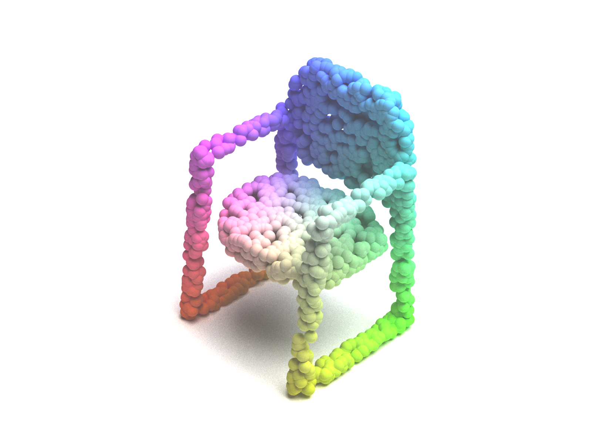

# Point Cloud Renderer

Instructions and scripts for rendering point cloud figures shown in **PointFlow: 3D Point Cloud Generation with Continuous Normalizing Flows**.

[[Paper]](https://arxiv.org/abs/1906.12320) [[Project GitHub]](https://github.com/stevenygd/PointFlow).

The script generates a XML file, which describes a 3D scene in the format used by Mitsuba. You will then be able to render it with Mitsuba.

## Dependencies
* Python 3.6+
* [Mitsuba Renderer 2](http://www.mitsuba-renderer.org/)

### Install Mitsuba2
```bash
sudo apt install -y clang-9 libc++-9-dev libc++abi-9-dev cmake ninja-build

sudo apt install -y libz-dev libpng-dev libjpeg-dev libxrandr-dev libxinerama-dev libxcursor-dev

sudo apt install -y python3-dev python3-distutils python3-setuptools

sudo apt install -y python3-pytest python3-pytest-xdist python3-numpy

sudo apt install -y python3-sphinx python3-guzzle-sphinx-theme python3-sphinxcontrib.bibtex

export CC=clang-9
export CXX=clang++-9

git clone --recursive https://github.com/mitsuba-renderer/mitsuba2
cd mitsuba2/

mkdir build
cd build/

cmake -GNinja ..
ninja

cd dist/
export PATH=$PWD:$PATH
```

## Instructions
```bash
# Generate scene XML file
python pointflow_fig_colorful.py

# Render using Mitsuba
mitsuba mitsuba_scene.xml
```

## Examples
<p float="left">
    
</p>

## Cite
Please consider citing our work if you find it useful:
```latex
@article{pointflow,
 title={PointFlow: 3D Point Cloud Generation with Continuous Normalizing Flows},
 author={Yang, Guandao and Huang, Xun, and Hao, Zekun and Liu, Ming-Yu and Belongie, Serge and Hariharan, Bharath},
 journal={arXiv},
 year={2019}
}
```
